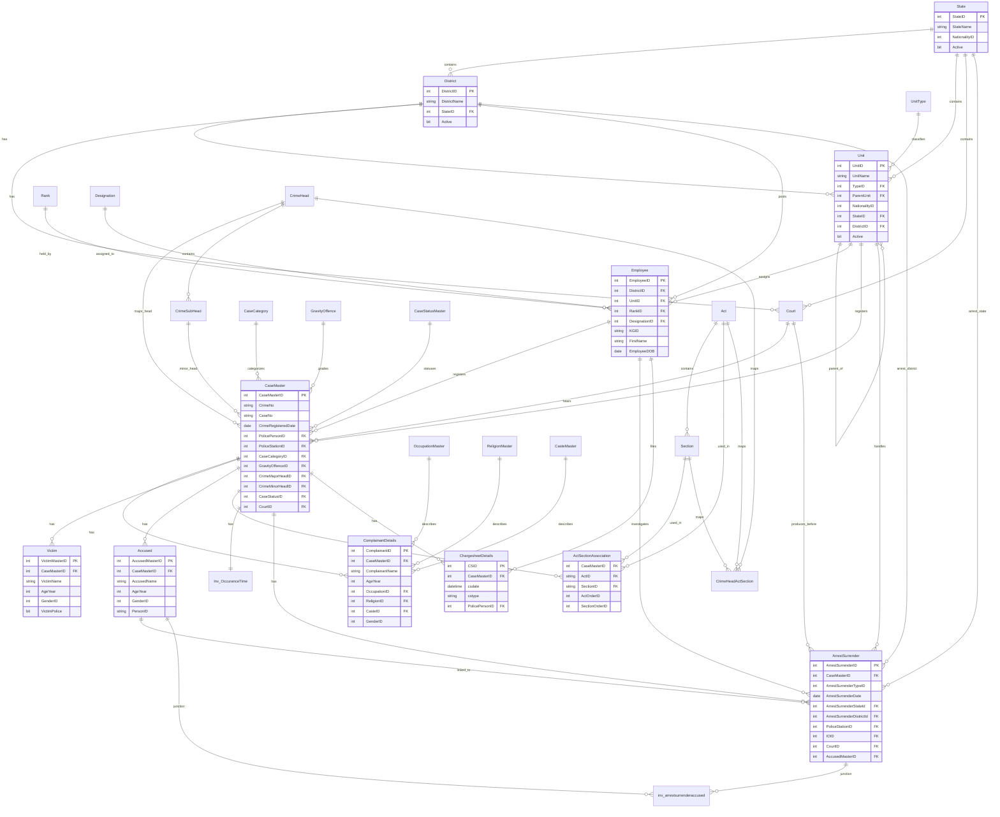

# Police FIR Database Schema

This folder uses the database shape described in `Police_FIR_ER_Diagram.pdf`. The active dummy seed data lives in:

```text
ksp-crime-analytics-revamp/scripts/data
```

The CSV files are generated by:

```bash
cd /Users/NIKITA/Desktop/otherWork/Datathon_2026/Zoho_Catalyst/ksp-crime-analytics-revamp/scripts
python3 generate_fir_er_data.py
```

Person names are intentionally masked in the generated data:

- `Employee.FirstName`: `OFF-A`, `OFF-B`, ...
- `ComplainantDetails.ComplainantName`: `CMP-A`, `CMP-B`, ...
- `Victim.VictimName`: `VIC-A`, `VIC-B`, ...
- `Accused.AccusedName`: `ACC-A`, `ACC-B`, ...

`Inv_OccuranceTime` and `inv_arrestsurrenderaccused` are included because they appear in the relationship matrix of the PDF. Their columns are inferred where the PDF did not provide a full table definition.

## Table Groups

Core case tables:

- `CaseMaster`
- `ComplainantDetails`
- `Victim`
- `Accused`
- `ArrestSurrender`
- `ChargesheetDetails`
- `ActSectionAssociation`
- `Inv_OccuranceTime`
- `inv_arrestsurrenderaccused`

Lookup and administrative tables:

- `State`
- `District`
- `Unit`
- `UnitType`
- `Employee`
- `Rank`
- `Designation`
- `Court`
- `CaseCategory`
- `GravityOffence`
- `CaseStatusMaster`
- `OccupationMaster`
- `ReligionMaster`
- `CasteMaster`
- `CrimeHead`
- `CrimeSubHead`
- `Act`
- `Section`
- `CrimeHeadActSection`

## Entity Relationship Diagram


