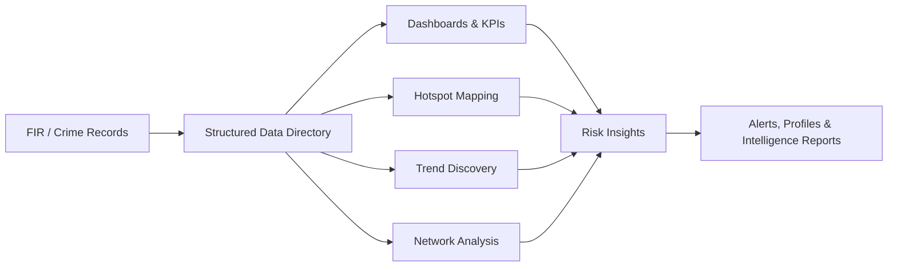

# KSP Crime Intelligence & Analytical Platform

Datathon 2026 prototype for transforming fragmented crime records into a unified, visual, and predictive intelligence workspace for Karnataka State Police.

## Overview

The Karnataka State Police maintains large volumes of FIR, crime, offender, victim, officer, police station, district, court, arrest, and chargesheet records. In many analytical workflows, these records remain fragmented across static files, manual reporting formats, or disconnected systems.

This prototype demonstrates a **Crime Intelligence & Analytical Platform** that turns those records into dashboards, hotspot maps, network graphs, alerts, entity profiles, and AI/ML-style risk insights.

The goal is to move from:

```text
Manual records + siloed analysis + reactive policing
```

to:

```text
Integrated data + criminological intelligence + proactive decision support
```

## Core Value Proposition

The platform acts as an intelligence layer over crime records.

It helps SCRB analysts, senior officers, and investigators answer:

- What is happening across districts and stations?
- Where are crime hotspots emerging?
- Which crime categories are rising?
- Who is connected across cases?
- Which offenders, stations, or districts require attention?
- What anomalies or risks should be flagged early?

## Key Features

### 1. FIR Intake & Digitization

- Upload scanned FIRs or case documents.
- Run OCR extraction on FIR files.
- Extract structured case fields such as FIR number, district, station, date, time, sections, and summary.
- Flag low-confidence fields for officer review.
- Prepare verified records for database entry.

### 2. State Intelligence Dashboard

- View state-level crime KPIs.
- Analyze incidents by crime type, district, hour, and day of week.
- Track FIR lifecycle metrics such as cases, arrests, chargesheets, and court pipeline.
- Compare patterns across years.

### 3. Geospatial Hotspot Map

- Explore district-level and station-level crime patterns.
- Switch between heatmap, district, and station views.
- Filter by year, month, and crime type.
- Identify spatial clusters for proactive resource deployment.

### 4. Pattern & Trend Discovery

- Compare monthly and year-over-year crime movement.
- Filter trends by district.
- Track solve-rate changes over time.
- Detect shifts in crime typologies.

### 5. Criminal Network & Link Analysis

- Visualize offender associations using an interactive D3 network graph.
- Identify gang affiliation, repeat offenders, and high-risk individuals.
- Inspect offender status, risk score, prior convictions, and relationship patterns.

### 6. Entity Profiles / DataCards

- Generate focused profiles for:
  - Crime types
  - Offenders
  - Officers
  - Victims
  - Districts
  - Police stations
- View linked statistics, case status, prominent offenders, station load, and behavioral patterns.

### 7. AI / ML Intelligence

- Predict district-level risk bands.
- Detect anomalies and crime spikes.
- Forecast emerging crime categories.
- Correlate crime with socio-economic indicators.
- Analyze repeat-offender and recidivism patterns.

### 8. Search & Data Directory

- Search by FIR number, crime type, offender name, or alias.
- Browse CSV-backed prototype tables.
- Filter, paginate, and inspect structured records.
- Use a unified data directory instead of scattered spreadsheets.

## Prototype Flow



## High-Level Architecture

```mermaid
flowchart LR
    subgraph UI["Frontend"]
        U1["React + Vite App"]
        U2["Dashboards"]
        U3["Maps"]
        U4["Network Graphs"]
        U5["FIR Intake"]
        U6["Data Directory"]
    end

    subgraph API["API Layer"]
        A1["Crime API"]
        A2["Analytics API"]
        A3["FIR OCR API"]
        A4["Data Seeder"]
    end

    subgraph DATA["Data Layer"]
        D1["CSV / JSON Prototype Data"]
        D2["Zoho Catalyst Datastore"]
        D3["FIR ER Tables"]
    end

    subgraph INTEL["Intelligence Layer"]
        I1["Hotspot Analytics"]
        I2["Trend Analytics"]
        I3["Network Analysis"]
        I4["Risk Scoring"]
        I5["Anomaly Detection"]
    end

    UI --> API
    API --> DATA
    DATA --> INTEL
    INTEL --> UI
```



## Technology Stack

### Frontend

- React
- Vite
- Tailwind CSS
- Lucide React
- Axios / Fetch APIs

### Visualization

- Recharts for dashboards and trend charts
- Leaflet and Leaflet Heat for geospatial maps
- D3.js for criminal network analysis
- Responsive tables for structured data exploration

### Backend

- Zoho Catalyst Functions
- Node.js
- Express.js
- Multer for FIR/document uploads
- Python Catalyst functions for analytics and data seeding

### Data & Analytics

- CSV / JSON prototype datasets
- Zoho Catalyst Datastore
- ZCQL queries
- Custom analytics logic
- Risk scoring, anomaly detection, correlation analysis, and network analysis

## Zoho Catalyst Services Used

- **Catalyst Functions**: serverless backend APIs for crime data, analytics, FIR OCR, and data seeding.
- **Catalyst Datastore**: structured storage for crime, FIR, offender, victim, officer, district, station, court, act, and chargesheet data.
- **ZCQL**: query layer for summaries, filters, search, drill-downs, and analytics.
- **Catalyst File Store**: used by the data seeder flow for reading uploaded CSV data.
- **Catalyst SDK**: Node.js and Python SDKs for accessing Catalyst services.
- **Catalyst Zia OCR-ready flow**: prototype FIR OCR workflow for document digitization.
- **ConvoKraft-ready assistant layer**: planned conversational interface for FIR and data Q&A.

## Repository Structure

```text
ksp-crime-analytics-revamp/
├── client/
│   ├── src/
│   │   ├── pages/              # Dashboard, map, trends, alerts, FIR intake, data views
│   │   ├── api/                # Catalyst API adapter and local mock API
│   │   └── mock-data/          # JSON prototype datasets
│   ├── package.json
│   └── vite.config.js
├── functions/
│   ├── crime-api-fn/           # Main Node.js crime API
│   ├── analytics-api-fn/       # Python analytics API
│   ├── fir-ocr-api-fn/         # FIR OCR/upload API
│   └── data-seeder-fn/         # Data ingestion/seeding function
├── scripts/
│   ├── data/                   # CSV source datasets
│   ├── schema.sql              # Datastore schema
│   └── generate_fir_er_data.py # FIR ER data generator
├── DEPLOYMENT_GUIDE.md
└── README.md
```

## Getting Started Locally

### Prerequisites

- Node.js 18+
- npm
- Python 3.9+ for backend/data scripts

### Run The Frontend

```bash
cd ksp-crime-analytics-revamp/client
npm install
npm run dev
```

The frontend uses mock data by default, so the prototype can be explored without deployed backend services.

### Build The Frontend

```bash
cd ksp-crime-analytics-revamp/client
npm run build
```

### Use Live APIs

Set these environment variables when connecting to deployed Catalyst functions:

```bash
VITE_USE_MOCKS=false
VITE_CRIME_API_URL=<crime-api-url>
VITE_ANALYTICS_API_URL=<analytics-api-url>
VITE_FIR_API_URL=<fir-ocr-api-url>
VITE_DATA_API_URL=<data-api-url>
```

## Main Frontend Modules

| Route | Module | Purpose |
| --- | --- | --- |
| `/` | Dashboard | State-level crime intelligence and FIR lifecycle insights |
| `/map` | Crime Map | District, station, and hotspot visualization |
| `/network` | Link Analysis | Offender network and association detection |
| `/trends` | Trends | Temporal pattern discovery |
| `/alerts` | Alerts | Anomaly and crime-spike alerts |
| `/updates` | New Updates | Recent case, offender, and officer activity |
| `/datacards` | DataCards | Entity-level investigative profiles |
| `/fir-intake` | FIR Intake | OCR-based FIR digitization workflow |
| `/predictions` | Predictions | Risk scores, forecasts, anomalies, and correlations |
| `/search` | Search | FIR, crime, and offender search |
| `/data-directory` | Data Directory | Structured table exploration |

## Prototype Data

The prototype includes two related data layers:

- Modern crime analytics mock data in `client/src/mock-data/`
- FIR ER schema-inspired data generated from `scripts/data/`

Person names in generated FIR data are masked for prototype safety:

- `Employee.FirstName`: `OFF-A`, `OFF-B`, ...
- `ComplainantDetails.ComplainantName`: `CMP-A`, `CMP-B`, ...
- `Victim.VictimName`: `VIC-A`, `VIC-B`, ...
- `Accused.AccusedName`: `ACC-A`, `ACC-B`, ...

## FIR ER Table Groups

### Core Case Tables

- `CaseMaster`
- `ComplainantDetails`
- `Victim`
- `Accused`
- `ArrestSurrender`
- `ChargesheetDetails`
- `ActSectionAssociation`
- `Inv_OccuranceTime`
- `inv_arrestsurrenderaccused`

### Lookup & Administrative Tables

- `State`
- `District`
- `Unit`
- `UnitType`
- `Employee`
- `Rank`
- `Designation`
- `Court`
- `CaseCategory`
- `GravityOffence`
- `CaseStatusMaster`
- `OccupationMaster`
- `ReligionMaster`
- `CasteMaster`
- `CrimeHead`
- `CrimeSubHead`
- `Act`
- `Section`
- `CrimeHeadActSection`

## Deployment

See [DEPLOYMENT_GUIDE.md](./DEPLOYMENT_GUIDE.md) for Catalyst setup, datastore import, function deployment, API routing, and frontend deployment steps.

## Future Development

- Indian law RAG assistant for source-grounded legal and procedural guidance.
- Role-based login for SCRB analysts, senior officers, station officers, investigators, and admins.
- Case assignment recommendations based on investigator workload, specialization, station, and crime type.
- Live integration with production-scale police data systems.
- Stronger AI/ML benchmarking for prediction accuracy and anomaly false positives.
- Mobile-first workflows for field officers.
- Audit logs, encryption, victim-data masking, and role-based exports.
- Full Catalyst deployment with monitoring and scheduled data refresh.

## Prototype Status

This is a first working prototype built for Datathon 2026. It is optimized for demonstrating the core workflow and intelligence capabilities using local mock/prototype datasets. Full production deployment would require secure live-data integration, role-based access control, validation against real historical records, and formal performance benchmarking.

